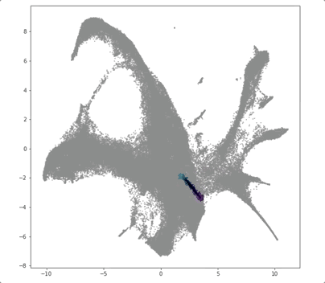

# prescient
Software for PRESCIENT (Potential eneRgy undErlying Single Cell gradIENTs), a generative model for modeling single-cell time-series.
+ Documentation available at prescient.github.io.
+ Current paper version: https://www.biorxiv.org/content/10.1101/2020.08.26.269332v1
+ For paper pre-processing scripts, training bash scripts, pre-trained models, and visualization notebooks please visit https://github.com/gifford-lab/prescient-analysis.

## Setup

+ pytorch 1.4.0
+ geomloss 0.2.3, pykeops 1.3
+ numpy, scipy, pandas, sklearn, tqdm, annoy
+ scanpy, pyreadr, anndata
+ Recommended: An Nvidia GPU with CUDA support for GPU acceleration (see paper for more details on computational resources)

## Organization

`/src` contains code for preprocessing data, training and evalating models:
+ `data.py` takes as input raw data or a Seurat object and produces a PRESCIENT formatted file.
+ `train.py` implements shared functions and classes, including the model and the main pre-training and training loop
+ `perturb.py` takes as input a PRESCIENT formatted file and

+ `weinreb.py` implements training and evaluation for interpolation and fate prediction tasks on the Weinreb et al. dataset
+ `veres.py` implements training on the Veres et al. dataset
+ To implement PRESCIENT for your dataset, follow the examples in `weinreb.py` and `veres.py` (more in-depth documentation and generalizable workflows coming soon!)

`/scripts` contains example bash scripts for fitting models:
+ `weinreb-interpolate.sh` trains 5 seeds of 2 layer 400 unit models on only lineage tracing data with ground truth proliferation rates for the interpolation task on the Weinreb et al. dataset
+ `weinreb-fate.sh` trains 5 seeds of 2 layer 400 unit models on all data with estimated proliferation rates for clonal fate bias prediction on the Weinreb et al. dataset
+ `veres-fate.sh` trains 5 seeds of 2 layer 400 unit models with estimated proliferation rates on the Veres et al. dataset

`/notebooks` contains tutorials on training for using PRESCIENT and generating visualizations from trained models (coming soon!):

## Bugs & Suggestions

Please report any bugs, problems, suggestions or requests as a [Github issue](https://github.com/gifford-lab/prescient/issues)
